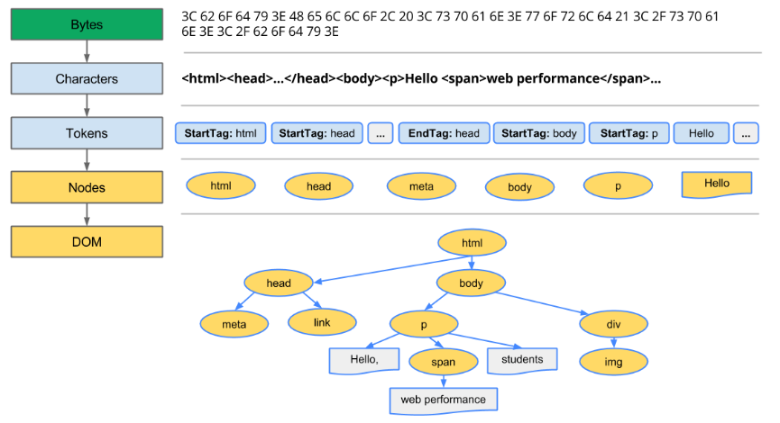

CSSOM树和DOM树合并成渲染树，然后用于计算每个可见原始的布局，并输出给绘制流程，将像素渲染到屏幕上。

## 文档对象模型DOM

1. **转化**：浏览器从磁盘或网络读取HTML原始字节，并根据文件的指定编码(如UTF8)将它们转换成各个字符。
2. **令牌化**：浏览器将字符转换成[W3C HTML5标准](https://www.w3.org/TR/html5/)规定的各种令牌，例如'<html>','<body>',以及其他尖括号内的字符串。每个令牌都具有特殊含义和一组规则。
3. **词法分析**：发出的令牌转换成定义其属性和规则的‘对象’。
4. **DOM构建**：最后，由于HTML标记定义不同标记之间的关系，创建的对象链接在一个树数据结构内，此结构也会捕获原始标记中定义的父项-子项关系：HTML对象是body对象的父项，body是paragraph的父项，以此类推。

## CSS对象模型CSSOM

与处理HTML时一样，我们需要将收到的css规则转换成浏览器能够理解和处理的东西。因此，我们会重复html的过程，不过是为css而不是html：
css转换成字符，然后是令牌和节点，最后链接到一个成为‘css对象模型(CSSOM)’的树结构内。

## 主要流程
Parsing HTML to construct the DOM tree -> Render tree construction -> Layout the render tree -> Painting the render tree
* Webkit(Chrome, Safari)

* Mozila(Firefox)

## Reference
*[渲染树构建、布局及绘制](https://developers.google.com/web/fundamentals/performance/critical-rendering-path/render-tree-construction?hl=zh-cn)
*[浏览器是怎样工作的：渲染引擎，HTML解析](http://ued.ctrip.com/blog/how-browsers-work-rendering-engine-html-parsing-series-ii.html)
