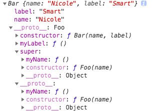

```js
function extands(source, target) {
  for (var key in source) {
    if (!target.hasOwnProperty(key)) {
        target[key] = source[key]
    }
  }
}
function OO(parentclass, subclass) {
  var parent = parentclass.prototype
  var child = subclass.prototype
  extands(parent, child)
  function F() {}
  F.prototype = subclass.prototype
  subclass.prototype = new F()
  subclass.prototype.constructor = subclass
  subclass.prototype.super = parent
}
```
使用OO的例子：
```js
function Foo (name) {
  this.name = name
}
Foo.prototype.myName = function () {
  console.log('MyName ' + this.name)
}

OO(Foo, Bar)
function Bar (name, label) {
  this.super.constructor.call(this, name)
  this.label = label
}
Bar.prototype.myName = function () {
  this.super.myName.call(this)
  console.log('Do something other')
}
Bar.prototype.myLabel = function () {
  console.log('MyLabel', this.label)
}

var bar = new Bar('Nicole', 'Smart')
bar.myName() // "MyName Nicole"  "Do something other"
bar.myLabel() // "MyLabel"  "Smart"
```
bar的结构


