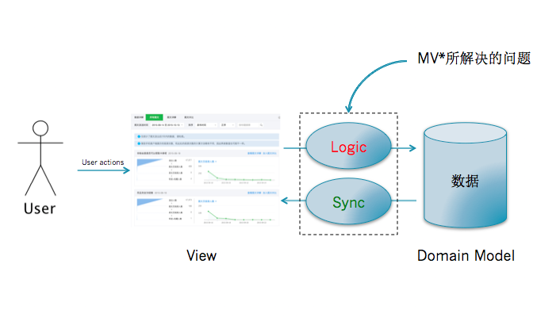

    
在开发应用程序的时候，以便更好的管理应用程序的复杂性，基于指责分离的思想都会将应用程序分层。在开发图形界面应用程序的时候，会把管理用户界面的层次叫做
View, 应用程序的数据为Model。Model提供提供数据操作的接口，执行相应的业务逻辑。

有了View和Model，那么问题就来了：View如何同步Model的变更，View和Model如何粘合在一起。
    
## MVC的依赖关系
MVC除了把应用程序分成了View、Model层，还额外的加了一个Controller层，他的指责为进行Model和View之间的协作（路由、输入预处理等）的应用逻辑；
Model进行处理业务逻辑。Model、View、Controller三个层次的依赖关系如下：

Controller和View都依赖Model层，Controller和View可以互相依赖。Controller和View的依赖关系关系可能是单向，也可能是双向，这个其实关系不大，后
面会看到他们的依赖关系都是为了把处理用户行为触发的事件处理权交给Controller。

## MVC的调用关系
用户对View操作以后，View捕获到这个操作以后，会把这个处理权交给移交给Controller；Controller会对来自View的数据进行预处理、决定调用哪个Model的
接口；然后由Model执行相关的业务逻辑，当Model变更了以后，会通过观察者模式通知View；View通过观察者模式收到Model变更以后的消息，会向Model请求最新的数
据，然后重新更新界面。如下图：

关键几点：

1. View是把控制权交移给Controller，Controller执行应用程序相关的应用逻辑（对来自View数据进行预处理、决定调用哪个Model的接口等等）。
2. Controller操作Model，Model执行业务逻辑对数据进行处理。但不会直接操作View，可以说它是对View无知的。 
3. View和Model的同步消息是通过观察者模式进行，而同步操作是由View自己请求Model的数据然后对视图进行更新。

MVC模式的精髓在于第三点：Model的更新是通过观察者模式告知View的，具体表现形式可以是Pub/Sub或者是触发Events。通过观察者模式的好处就是：不同的MVC
三角关系可能会有共同的Model，一个MVC三角中的Controller操作了Model以后，两个MVC三角的View都会接受到通知，然后更新自己。保持了依赖同一块Model的不同
View显示数据的实时性和准确性。

**MVC的优缺点**

优点

1. 把业务逻辑和展示逻辑分离，模块化程度高。且当应用逻辑需要变更的时候，不需要变更业务逻辑和展示逻辑，只需要Controller换成另外一个Controller。
2. 观察者模式可以做到多视图同时更新。

缺点

1. Controller测试困难。因为视图同步操作是由View自己执行，而View只能在有UI的环境下运行。在没有UI环境下对Controller进行单元测试的时候，应用
逻辑正确性是无法验证的：Model更新的时候，无法对View的更新操作进行断言。
2. View无法组件化。View是强依赖特定的Model的，如果需要把这个View抽出来作为一个另外一个应用程序可复用的组件就困难了。因为不同程序的的Domain 
Model是不一样的。

## MVP
MVP模式有两种，Passive View和Supervising Controller。而大多数情况下讨论的都是Passive View模式，这里对Passive View做详细介绍，SC简单提及

**MVP（Passive View）的依赖关系**

MVP模式把MVC模式中的Controller换成了Presenter。MVP层次之间的依赖关系如下：
    

    
MVP打破了View原来对于Model的依赖，其余的依赖关系和MVC模式一致。
 
**MVP（Passive View）的调用关系**

MVP的调用关系如下：
    

   
关键点：

1. View不再负责同步的逻辑，而是由Presenter负责。Presenter中既有应用程序逻辑也有同步逻辑。
2. View需要提供操作界面的接口给Presenter进行调用，从而更新界面。
    
**MVP（Passive View）的优缺点**

优点

1. 便于测试。Presenter对View是通过接口进行，在对Presenter进行不依赖UI环境的单元测试的时候。可以通过Mock一个View对象，这个对象只需要实现了
View的接口即可。然后依赖注入到Presenter中，单元测试的时候就可以完整的测试Presenter应用逻辑的正确性。
2. View可以进行组件化。在MVP当中，View不依赖Model。这样就可以让View从特定的业务场景中脱离出来，可以说View可以做到对业务完全无知。它只需要提供
一系列接口提供给上层操作。这样就可以做到高度可复用的View组件。

缺点

    Presenter中除了应用逻辑以外，还有大量的View->Model，Model->View的手动同步逻辑，造成Presenter比较笨重，维护起来会比较困难。

## MVP（Supervising Controller）
Passive View模式下View非常Passive，Presenter让它干什么它就干什么。而Supervising Controller模式中，Presenter会把一部分简单的同步逻辑交给
View自己去做，Presenter只负责比较复杂的、高层次的UI操作，所以可以把它看成一个Supervising Controller。

    
## MVVM
MVVM可以看作是一种特殊的MVP（Passive View）模式，或者说是对MVP模式的一种改良。

**ViewModel**

MVVM代表的是Model-View-ViewModel,ViewModel的含义就是 "Model of View"，视图的模型。它的含义包含了领域模型(Domain Model)和视图的状态
(State)。在图形界面应用程序当中，界面所提供的信息可能不仅仅包含应用程序的领域模型。还可能包含一些领域模型不包含的视图状态。

可以简单把ViewModel理解为页面上所显示内容的数据抽象，和Domain Model不一样，ViewModel更适合用来描述View。
 
**MVVM的依赖**

MVVM的依赖关系和MVP依赖，只不过是把P换成了VM。
    

    
**MVVM的调用关系**

MVVM的调用关系和MVP一样。但是，在ViewModel当中会有一个叫Binder，或者是Data-binding engine的东西。以前全部由Presenter负责的View和Model之
间数据同步操作交由给Binder处理。你只需要在View的模版语法当中，指令式地声明View上的显示的内容是和Model的哪一块数据绑定的。当ViewModel对进行Model更新
的时候，Binder会自动把数据更新到View上去，当用户对View进行操作（例如表单输入），Binder也会自动把数据更新到Model上去。这种方式称为：Two-way 
data-binding，双向数据绑定。

**MVVM的优缺点**

优点

1. 提高可维护性。解决了MVP大量的手动View和Model同步的问题，提供双向绑定机制。提高了代码的可维护性。
2. 简化测试。因为同步逻辑是交由Binder做的，View跟着Model同时变更，所以只需要保证Model的正确性，View就正确。大大减少了对View同步更新的测试。

缺点

1. 过于简单的图形界面不适用。
2. 对于大型的图形应用程序，视图状态较多，ViewModel的构建和维护的成本都会比较高。
3. 数据绑定的声明是指令式地写在View的模版当中的，这些内容是没办法去打断点debug的。
